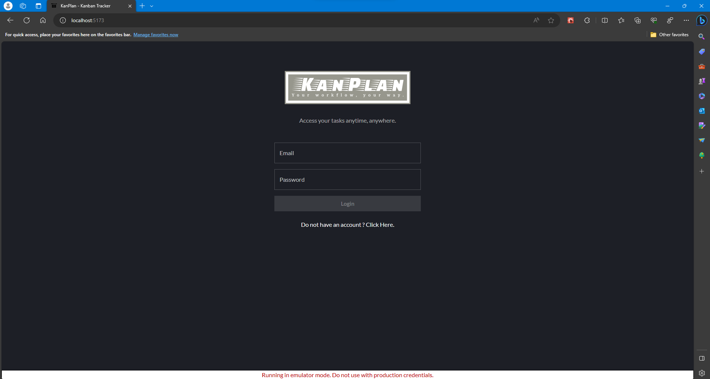
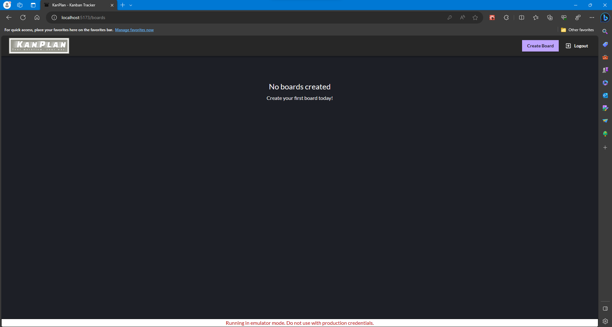
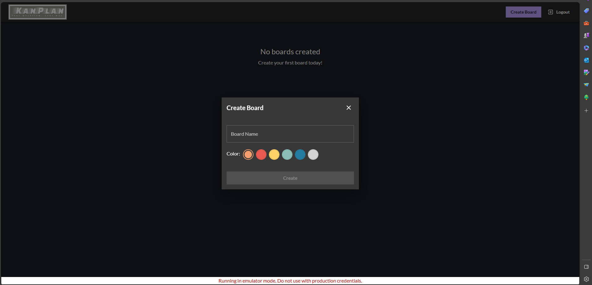
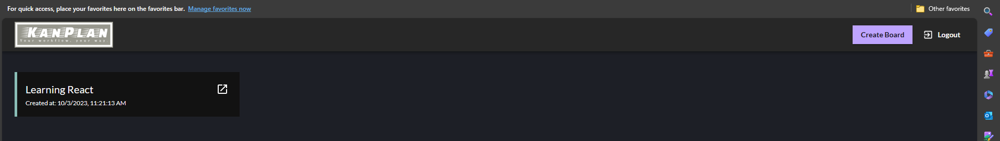
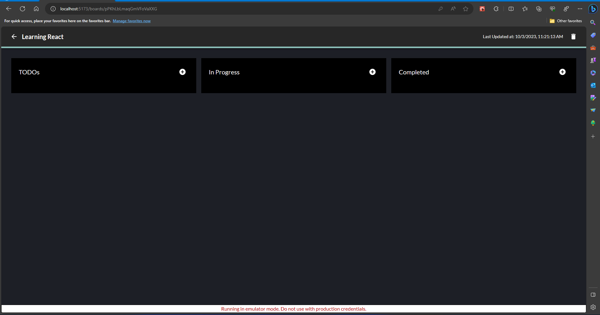
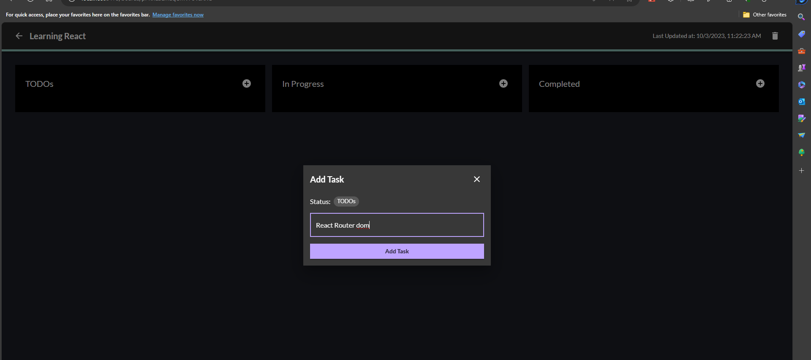
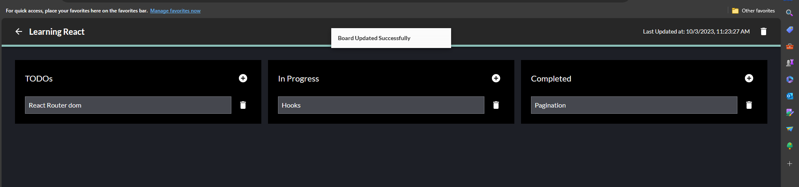

# KanPlan - A Kanban Tracker

This website lets you track your progress with the help of a drag and drop Kanban board.

## Technologies Used
### React.js: 
I have leveraged the latest features of React.js, including custom hooks, to build the front-end of our application. React provides a flexible and efficient way to create user interfaces. I have used the dnd package to implement Drag & Drop functionality

### Firebase: 
Firebase is a go-to backend solution, offering a range of services such as Hosting, Emulators, Firestore, Cloud Functions, and Security Rules. Firebase, will ensure our app is secure, scalable, and globally accessible.

### Zustand: 
To simplify state management, I have implement Zustand. This library provides an efficient and straightforward approach to handling the application's state, reducing unnecessary complexities.

## features

## 🚀 About Me
I'm a full stack developer currently working in Cisco.

## 🔗 Links

## 🛠 Skills
HTML, CSS, JS, ReactJS, Next.JS, TailwindCSS, Python Django, Flask, AWS, GCP.

